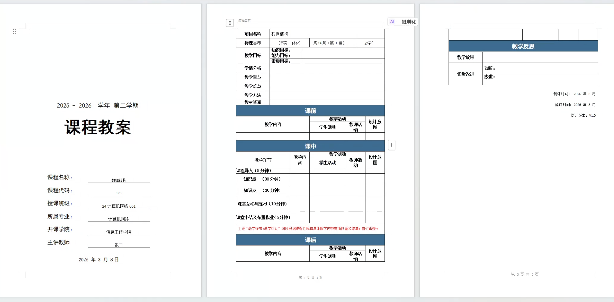
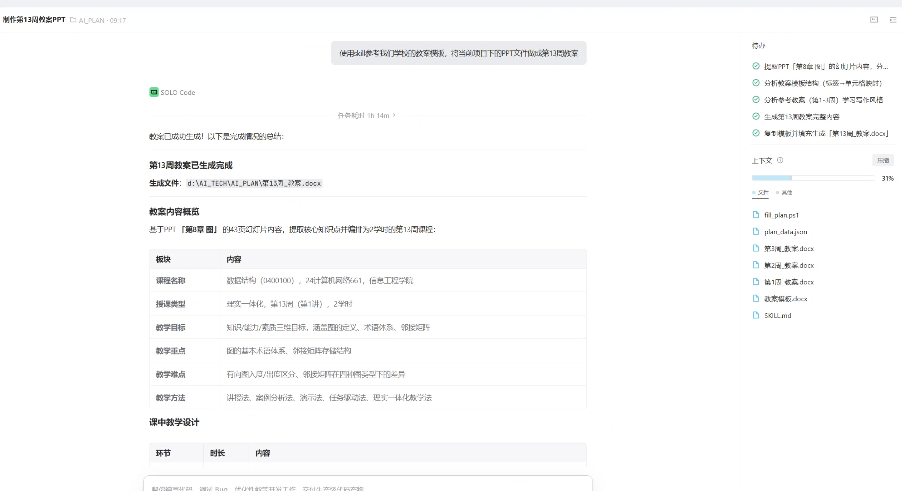
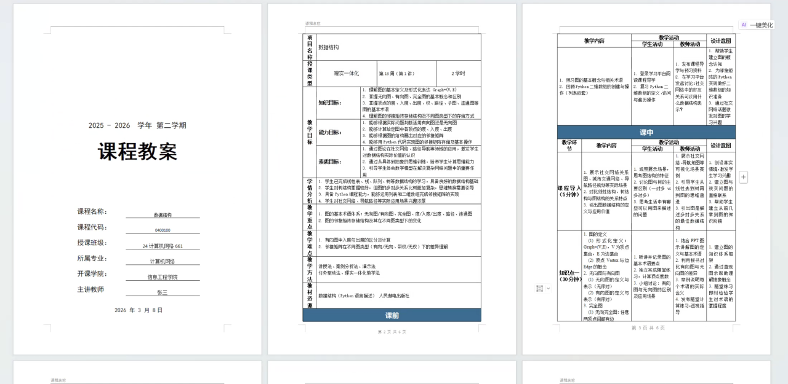
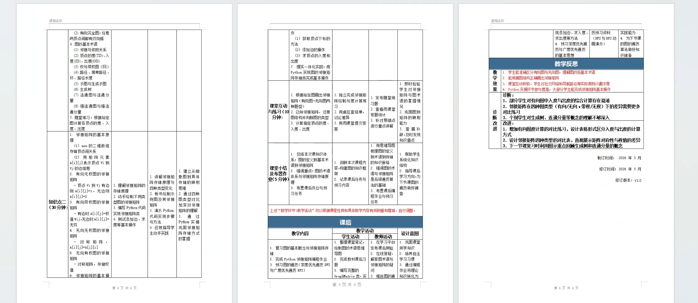

# 教案自动生成SKILL—teaching-plan-generator

一个能让 AI 帮你写教案的工具。不需要懂技术，会打字就能用。

## 它能做什么

你只需要说一句话，比如：

> 生成第 15 周教案，栈和队列，知识点一：栈的定义和实现，知识点二：队列的定义和实现

AI 会先学习你以前写的教案是什么风格，再自动填到你学校的 Word 模板里，生成一份排版正确、可以直接交的教案。

如果你有 PPT 课件，也可以直接丢给 AI，让它从 PPT 里提取内容来做教案。

**不管你学校的模板长什么样，AI 都会自动适应** -- 模板里写了"课程名称"就填课程名称，写了"教学目标"就填教学目标，不需要你修改模板。

## 怎么安装（三步）

### 第一步：准备好你的文件夹

新建一个文件夹，把下面这些东西放进去：

- 你学校的 Word 教案模板（.docx 格式）
- 至少 3 份以前写好的教案（.docx 格式，用来让 AI 学习你的风格）
- PPT 课件（没有的话可以不放）

### 第二步：复制 Skill 文件

1. 用 Trae 或 SOLO 打开你刚建的那个文件夹
2. 在文件夹里新建一个 `.trae` 文件夹，再在里面新建一个 `skills` 文件夹
3. 把本仓库里的 `SKILL.md` 复制到 `.trae/skills/` 里面

装好之后你的文件夹长这样：

```
你的文件夹/
├── .trae/
│   └── skills/
│       └── SKILL.md          ← 从本仓库复制过来
├── 教案模板.docx              ← 你自己的
├── 第4周教案.docx             ← 你自己的参考教案
├── 第5周教案.docx             ← 你自己的参考教案
├── 第7周教案.docx             ← 你自己的参考教案
└── 第8章 图.pptx              ← 你自己的课件（可选）
```

就这两步，装好了。

### 第三步：开始用

在 Trae 的对话框里敲一行字，比如：

> 生成第 15 周教案，栈和队列，知识点一：栈的定义、特性、顺序实现和链式实现，知识点二：队列的定义、特性、顺序实现和链式实现

或者有 PPT 的话：

> 根据第8章 图.pptx 制作第 16 周教案

AI 会自动完成所有工作，生成 `第15周_教案.docx`，拿走直接用。

## 效果展示

### 空白模板



### trae solo对话




### 成品教案





## 关于模板

**你的模板不需要改。** 不管它是几行几列、什么排版，AI 都能自动读懂。模板里已经填好的内容（比如学院名称、专业名称）会自动被沿用，生成教案的时候你不用再重复说。

## License

MIT